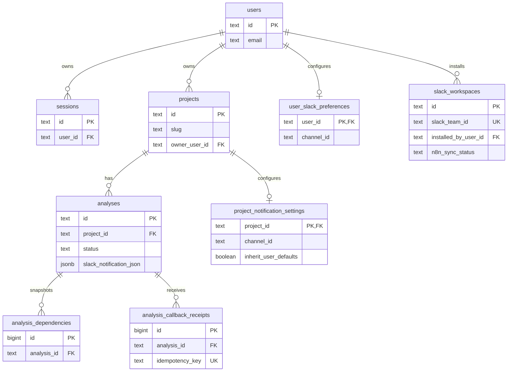

# Base de Datos

## Objetivo

Postgres es la fuente de verdad de la app.

La base guarda:

- usuarios y sesiones
- ownership de proyectos
- snapshots de análisis
- dependencias normalizadas
- receipts de callback para idempotencia
- instalación activa de Slack
- defaults Slack por usuario
- overrides Slack por proyecto
- auditoría del último resultado de notificación

No hay ORM. La app usa `Bun.SQL`.

## Migraciones relevantes

- `0001_initial.sql`
- `0002_product_statuses_and_subscriptions.sql`
- `0003_dependency_resolution.sql`
- `0004_users.sql`
- `0005_drop_automation_subscriptions.sql`
- `0006_slack_notifications.sql`

La migración `0005_drop_automation_subscriptions.sql` elimina el modelo legacy. No hay compatibilidad runtime con esa tabla.

## Tablas

### `users`

Usuarios de la app.

- `id` `text` PK
- `name` `text`
- `email` `text`
- `password_hash` `text`
- `created_at`
- `updated_at`

Índices:

- `users_email_idx` sobre `LOWER(email)`

### `sessions`

Sesiones activas.

- `id` `text` PK
- `user_id` FK a `users.id`
- `expires_at`
- `created_at`

Índices:

- `sessions_user_idx`
- `sessions_expires_idx`

### `projects`

Identidad lógica del proyecto.

- `id` `text` PK
- `slug` `text`
- `name` `text`
- `ecosystem` `text`, hoy sólo `npm`
- `owner_user_id` FK nullable a `users.id`
- `created_at`
- `updated_at`

Notas:

- `slug` dejó de ser único globalmente
- la unicidad útil queda en `projects_owner_slug_idx`
- dos usuarios pueden reutilizar el mismo `slug`

Índices:

- `projects_owner_slug_idx` sobre `(owner_user_id, slug)` cuando `owner_user_id IS NOT NULL`

### `analyses`

Snapshot de una corrida.

- `id` `text` PK
- `project_id` FK a `projects.id`
- `status` `queued | enriching | summarizing | completed | failed`
- `manifest_name`
- `manifest_json`
- `stats_json`
- `request_payload_json`
- `callback_payload_json`
- `summary_markdown`
- `summary_html`
- `upgrade_plan_json`
- `package_briefs_json`
- `sources_json`
- `slack_digest_markdown`
- `slack_notification_json`
- `webhook_response_json`
- `error_message`
- `n8n_execution_id`
- `last_idempotency_key`
- `created_at`
- `updated_at`
- `completed_at`

`slack_notification_json` persiste el resultado operativo del envío:

```json
{
	"enabled": true,
	"attempted": true,
	"status": "sent",
	"channelId": "C123",
	"channelName": "deps-alerts",
	"reason": null,
	"notifiedAt": "2026-03-26T00:00:00.000Z"
}
```

Índices:

- `analyses_project_created_idx`
- `analyses_status_idx`

### `analysis_dependencies`

Dependencias normalizadas por análisis.

- `id` identity PK
- `analysis_id` FK a `analyses.id`
- `name`
- `dependency_group`
- `current_version`
- `latest_version`
- `diff_type`
- `deprecated`
- `published_at`
- `repository_url`
- `risk_score`
- `decision`
- `source_urls_json`
- `resolution_json`

Restricciones:

- unique por `(analysis_id, name, dependency_group)`

Índices:

- `analysis_dependencies_analysis_idx`

### `analysis_callback_receipts`

Soporte de idempotencia del callback.

- `id` identity PK
- `analysis_id` FK a `analyses.id`
- `idempotency_key` unique
- `received_at`
- `payload_hash`

### `slack_workspaces`

Workspace Slack activo del despliegue.

- `id` `text` PK
- `slack_team_id` unique
- `team_name`
- `bot_user_id`
- `scope`
- `bot_access_token_encrypted`
- `installed_by_user_id` FK a `users.id`
- `is_active`
- `n8n_credential_id`
- `n8n_credential_name`
- `n8n_sync_status` `pending | synced | failed`
- `n8n_sync_error`
- `last_synced_at`
- `created_at`
- `updated_at`

Índices:

- `slack_workspaces_single_active_idx`
- `slack_workspaces_installed_by_idx`

Notas:

- el modelo es `workspace único por despliegue`
- el token bot se guarda cifrado, no en claro
- la app intenta sincronizar una credencial administrada en `n8n`

### `user_slack_preferences`

Defaults Slack por usuario.

- `user_id` PK/FK a `users.id`
- `enabled`
- `channel_id`
- `channel_name`
- `notify_on_success`
- `notify_on_failure`
- `include_brief`
- `include_top_packages`
- `top_packages_limit`
- `created_at`
- `updated_at`

### `project_notification_settings`

Overrides Slack por proyecto.

- `project_id` PK/FK a `projects.id`
- `enabled`
- `inherit_user_defaults`
- `channel_id`
- `channel_name`
- `notify_on_success`
- `notify_on_failure`
- `include_brief`
- `include_top_packages`
- `top_packages_limit`
- `created_at`
- `updated_at`

## Relaciones



## Reglas operativas

### Estados del análisis

- `queued`: análisis creado
- `enriching`: backend consultando npm y preparando payload
- `summarizing`: `n8n` aceptó el webhook y sigue procesando
- `completed`: callback válido aplicado
- `failed`: error terminal o callback inválido sin recuperación

### Idempotencia

- el callback exige `x-idempotency-key`
- la app inserta primero en `analysis_callback_receipts`
- si la key ya existe, no reaplica el resultado
- si el análisis ya estaba terminal, tampoco reaplica artefactos

### Slack

- la app resuelve settings efectivos en servidor
- el token de Slack nunca sale al cliente ni al webhook inicial
- `slack_notification_json` es auditoría, no configuración
- la configuración vive en `user_slack_preferences` y `project_notification_settings`

## Variables relacionadas

```bash
DATABASE_URL=
APP_BASE_URL=
N8N_ANALYSIS_WEBHOOK_URL=
N8N_ANALYSIS_WEBHOOK_TOKEN=
N8N_CALLBACK_SECRET=
N8N_API_BASE_URL=
N8N_API_KEY=
SLACK_CLIENT_ID=
SLACK_CLIENT_SECRET=
SLACK_INSTALLATION_ENCRYPTION_KEY=
```

## Comandos útiles

```bash
bun run db:ping
bun run db:migrate
```
