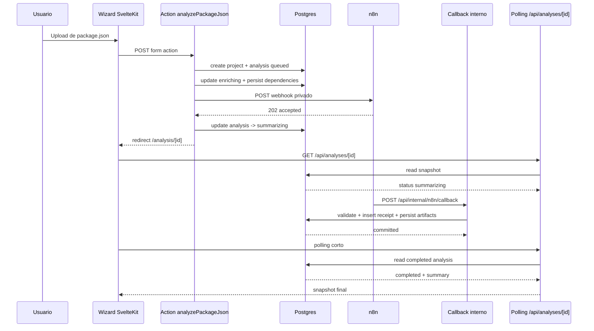

# Base de Datos

## Objetivo

Postgres es la fuente de verdad de Package Version Wizard. La base guarda:

- proyectos persistidos
- análisis compartibles por URL
- snapshots de dependencias y riesgo
- artefactos AI devueltos por n8n
- receipts de callback para idempotencia
- suscripciones Slack para radar continuo

La integración usa `Bun.SQL` nativo. No hay ORM.

## Capa de datos

- `src/lib/server/db/client.ts`: singleton de `Bun.SQL` en runtime
- `src/lib/server/db/migrate.ts`: runner de migraciones con `schema_migrations`
- `src/lib/server/analysis/repository.ts`: queries y mapeo entre SQL y el dominio
- `scripts/db/ping.ts`: prueba de conexión
- `scripts/db/migrate.ts`: ejecución manual de migraciones

## Estrategia de migraciones

- Las migraciones viven en `src/lib/server/db/migrations`
- Se aplican una sola vez en orden lexicográfico
- Cada archivo corre dentro de una transacción
- El contenedor puede ejecutar `bun run db:migrate` en cada deploy sin reescribir lo ya aplicado

## Modelo relacional

### `projects`

Identidad lógica del proyecto.

- `id`: PK textual generada en la app
- `slug`: slug reutilizable y único
- `name`: nombre visible del proyecto
- `ecosystem`: hoy fijo en `npm`

### `analyses`

Snapshot completo de una corrida.

- `id`: PK textual igual al `analysisId`
- `project_id`: FK a `projects`
- `status`: `queued | enriching | summarizing | completed | failed`
- `manifest_name`: nombre original del archivo
- `manifest_json`: contenido persistido del `package.json`
- `stats_json`: métricas agregadas visibles en UI
- `request_payload_json`: payload enviado a n8n
- `callback_payload_json`: payload recibido desde n8n
- `summary_markdown` / `summary_html`: brief renderizable
- `upgrade_plan_json`, `package_briefs_json`, `sources_json`: bloques estructurados para UI
- `slack_digest_markdown`: digest reutilizable para automations
- `webhook_response_json`: respuesta inicial del webhook a n8n
- `error_message`: fallo terminal si aplica
- `last_idempotency_key`: callback aplicado más reciente

`sources_json` no es un espejo ciego del modelo. La app persiste únicamente fuentes que ya pasaron la whitelist del workflow:

- en `package-research`, la URL debe existir en la evidencia recopilada para ese paquete
- en `dependency-analysis`, la URL debe existir en la consolidación base del análisis

### `analysis_dependencies`

Snapshot normalizado de dependencias por análisis.

- una fila por paquete y grupo
- guarda versiones, diff, `deprecated`, score, decisión preliminar y fuentes

### `automation_subscriptions`

Suscripciones del proyecto a automatizaciones continuas.

- hoy solo `channel_type = 'slack'`
- `channel_target`: canal o destino
- `frequency`: `daily | weekdays | twice_daily`
- `enabled`: estado actual de la suscripción

### `analysis_callback_receipts`

Soporte de idempotencia del callback de n8n.

- un `x-idempotency-key` se aplica una sola vez
- guarda `payload_hash` para trazabilidad

## Reglas operativas

### Estados

- `queued`: análisis creado y persistido
- `enriching`: el backend consulta npm y calcula riesgo preliminar
- `summarizing`: n8n aceptó el webhook y está generando el brief
- `completed`: callback válido aplicado
- `failed`: error terminal de dispatch, enriquecimiento o callback

Notas:

- `completed` puede representar una síntesis completa o una síntesis degradada si el workflow padre logró conservar `packageBriefs` y fuentes válidas aunque el LLM final falle.
- `failed` se reserva para errores sin artefactos útiles o callbacks inválidos que no pueden normalizarse.

### Idempotencia

- El callback exige `x-idempotency-key`
- La app inserta primero en `analysis_callback_receipts`
- Si la key ya existe, responde como duplicado
- Si el análisis ya es terminal, no reaplica artefactos aunque llegue otra key

### Trazabilidad y resiliencia del callback

- El callback final desde n8n a la app está firmado con `x-n8n-signature`.
- El workflow padre aplica timeout y retries en la entrega del callback para tolerar fallos transitorios de red.
- La app valida el contrato estructural del callback antes de persistirlo.

### Radar continuo

- Las suscripciones activas se leen desde `automation_subscriptions`
- El endpoint interno de radar reutiliza `manifest_json` del último análisis del proyecto
- Los deep links a Slack se construyen con `APP_BASE_URL`

## Diagramas

### ERD


### Flujo de datos



## Variables relevantes

```bash
DATABASE_URL=
APP_BASE_URL=
N8N_ANALYSIS_WEBHOOK_URL=
N8N_ANALYSIS_WEBHOOK_TOKEN=
N8N_CALLBACK_SECRET=
N8N_INTERNAL_API_TOKEN=
```

## Comandos

```bash
bun run db:ping
bun run db:migrate
bun run start
```
