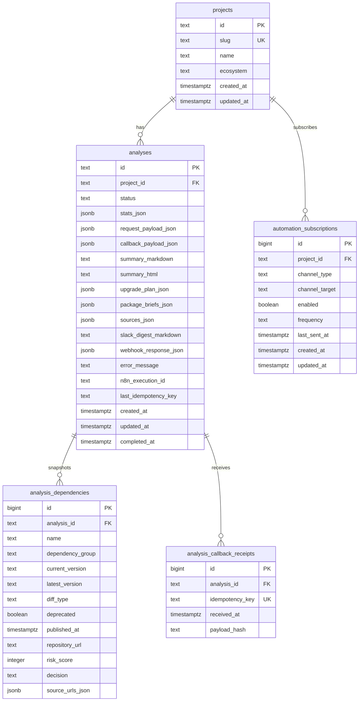
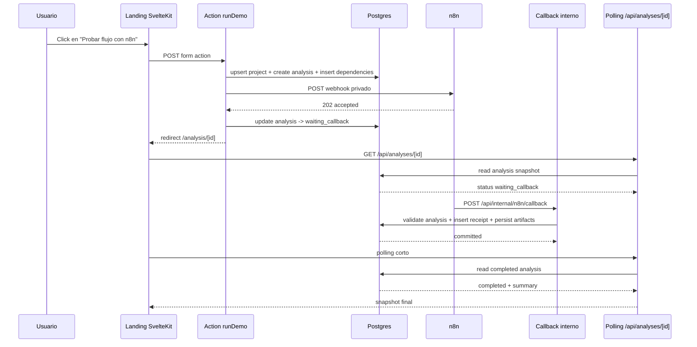

# Base de Datos

## Objetivo

La app deja de depender de memoria local y pasa a usar Postgres como fuente de verdad para:

- corridas persistidas de análisis
- historial por proyecto
- deduplicación de callbacks de n8n
- crecimiento futuro hacia uploads reales, rechecks y automatizaciones

La integración usa `Bun.SQL` nativo. No hay ORM.
Como la capa de datos depende de `Bun.SQL`, el runtime de producción debe ejecutarse con Bun.
El contenedor de producción ejecuta `bun run db:migrate` al arrancar y luego levanta la app.

## Arquitectura

### Capa de acceso

- `src/lib/server/db/client.ts`: singleton de `Bun.SQL` para la app
- `src/lib/server/db/migrate.ts`: runner de migraciones con tabla `schema_migrations`
- `src/lib/server/analysis/repository.ts`: queries y mapeo entre Postgres y tipos de dominio
- `src/lib/server/analysis/service.ts`: orquestación de demo, dispatch a n8n y callback

### Estrategia de migraciones

- Las migraciones viven en `src/lib/server/db/migrations`
- `bun run db:migrate` crea `schema_migrations` si no existe
- Cada archivo `.sql` se aplica una sola vez, en orden lexicográfico
- Cada migración se ejecuta dentro de transacción
- El arranque del contenedor puede correr migraciones en cada deploy sin reescribir esquema ya aplicado

## Modelo relacional

### `projects`

Representa una identidad lógica reutilizable del proyecto.

- `id`: PK textual generada en la app
- `slug`: clave única estable
- `name`: nombre visible del proyecto
- `ecosystem`: hoy fijo en `npm`

### `analyses`

Snapshot completo de una corrida.

- `id`: PK textual, igual al `analysisId`
- `project_id`: FK a `projects`
- `status`: `sending | waiting_callback | completed | failed`
- `request_payload_json`: payload enviado a n8n
- `callback_payload_json`: payload recibido desde n8n
- `summary_markdown` / `summary_html`: artefactos renderizables
- `upgrade_plan_json`, `package_briefs_json`, `sources_json`: bloques estructurados para UI
- `webhook_response_json`: respuesta inicial de aceptación del webhook
- `error_message`: fallo terminal si aplica
- `last_idempotency_key`: último callback aplicado

### `analysis_dependencies`

Snapshot normalizado de dependencias por análisis.

- una fila por paquete y grupo
- guarda versiones, tipo de diff, `deprecated`, score y metadata básica

### `automation_subscriptions`

Esquema listo para alertas y rechecks futuros. No tiene UI todavía.

### `analysis_callback_receipts`

Soporte de idempotencia del callback.

- un `idempotency_key` se aplica una sola vez
- guarda `payload_hash` para trazabilidad

## Reglas operativas

### Estados

- `sending`: análisis creado antes del dispatch a n8n
- `waiting_callback`: n8n aceptó el webhook
- `completed`: callback exitoso y persistido
- `failed`: fallo de dispatch o callback fallido

### Timestamps

- `created_at`: creación del registro
- `updated_at`: última mutación
- `completed_at`: momento terminal del análisis
- `received_at`: llegada del callback deduplicado

### Idempotencia

- El callback exige `x-idempotency-key`
- Se inserta primero en `analysis_callback_receipts`
- Si la key ya existe, el callback se trata como duplicado
- Si el análisis ya está en estado terminal, no se reaplica aunque llegue otra key

## Diagramas

### ERD



### Flujo de datos



## Comandos

```bash
bun run db:ping
bun run db:migrate
bun run start
```

Ambos comandos esperan `DATABASE_URL` en el entorno.
En Docker, las migraciones se ejecutan automáticamente al arrancar salvo que `RUN_DB_MIGRATIONS=false`.
