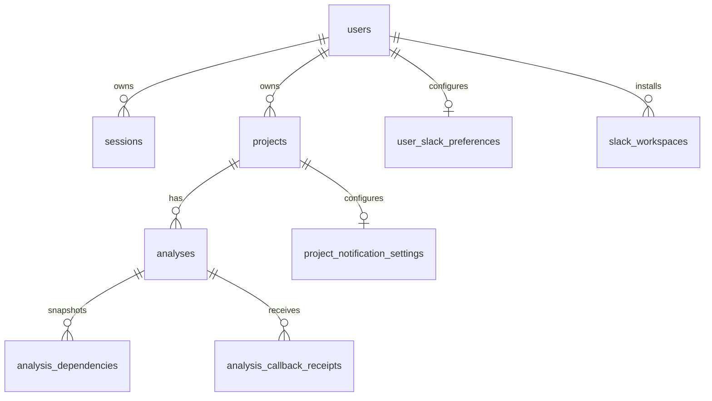

# Base de datos

## Resumen

Postgres es la fuente de verdad de la app. La capa de acceso usa `Bun.SQL`; no hay ORM. El esquema vive en [`src/lib/server/db/migrations`](../src/lib/server/db/migrations) y las migraciones se aplican con `bun run db:migrate`.

## Qué persiste la app

- usuarios y sesiones
- proyectos con ownership por usuario
- snapshots completos de análisis
- dependencias normalizadas por análisis
- receipts del callback de `n8n` para idempotencia
- workspaces de Slack por usuario
- defaults de Slack por usuario
- overrides de Slack por proyecto
- auditoría del último resultado de notificación
- versiones aplicadas en `schema_migrations`

## Tablas principales

### `users`

Usuarios de la app.

- `id` `text` PK
- `name` `text`
- `email` `text`
- `password_hash` `text`
- `created_at`
- `updated_at`

Índice relevante:

- `users_email_idx` sobre `LOWER(email)`

### `sessions`

Sesiones activas.

- `id` `text` PK
- `user_id` FK a `users.id`
- `expires_at`
- `created_at`

Índices relevantes:

- `sessions_user_idx`
- `sessions_expires_idx`

### `projects`

Identidad lógica del proyecto analizado.

- `id` `text` PK
- `slug` `text`
- `name` `text`
- `ecosystem` `text`, hoy solo `npm`
- `owner_user_id` FK nullable a `users.id`
- `created_at`
- `updated_at`

Regla de unicidad útil:

- `projects_owner_slug_idx` sobre `(owner_user_id, slug)` cuando `owner_user_id IS NOT NULL`

Esto permite que dos usuarios tengan proyectos con el mismo nombre o slug sin colisionar entre sí.

### `analyses`

Snapshot completo de una corrida.

- `id` `text` PK
- `project_id` FK a `projects.id`
- `status` `queued | enriching | summarizing | completed | failed`
- `manifest_name`
- `manifest_json`
- `stats_json`
- `request_payload_json`
- `callback_payload_json`
- `summary_markdown`
- `summary_html`
- `upgrade_plan_json`
- `package_briefs_json`
- `sources_json`
- `slack_digest_markdown`
- `slack_notification_json`
- `webhook_response_json`
- `error_message`
- `n8n_execution_id`
- `last_idempotency_key`
- `created_at`
- `updated_at`
- `completed_at`

Índices relevantes:

- `analyses_project_created_idx`
- `analyses_status_idx`

`summary_html` guarda el resultado saneado del Markdown. `slack_notification_json` persiste el estado operativo del envío a Slack, por ejemplo:

```json
{
	"attempted": true,
	"status": "sent",
	"channelId": "C123",
	"channelName": "deps-alerts",
	"notifiedAt": "2026-03-31T00:00:00.000Z"
}
```

### `analysis_dependencies`

Dependencias normalizadas por análisis.

- `id` identity PK
- `analysis_id` FK a `analyses.id`
- `name`
- `dependency_group`
- `current_version`
- `latest_version`
- `diff_type`
- `deprecated`
- `published_at`
- `repository_url`
- `risk_score`
- `decision`
- `source_urls_json`
- `resolution_json`

Restricción:

- unique por `(analysis_id, name, dependency_group)`

Índice relevante:

- `analysis_dependencies_analysis_idx`

`resolution_json` almacena datos como `declaredSpec`, `wantedVersion`, `latestVersion`, `comparisonStatus`, `requiresManualReview` y estado de deprecación.

### `analysis_callback_receipts`

Recibos para idempotencia del callback.

- `id` identity PK
- `analysis_id` FK a `analyses.id`
- `idempotency_key` unique
- `received_at`
- `payload_hash`

### `slack_workspaces`

Workspace activo de Slack por usuario.

- `id` `text` PK
- `slack_team_id`
- `team_name`
- `bot_user_id`
- `scope`
- `bot_access_token_encrypted`
- `installed_by_user_id` FK a `users.id`
- `is_active`
- `n8n_credential_id`
- `n8n_credential_name`
- `n8n_sync_status` `pending | synced | failed`
- `n8n_sync_error`
- `last_synced_at`
- `created_at`
- `updated_at`

Índices relevantes:

- `slack_workspaces_user_team_idx`
- `slack_workspaces_user_active_idx`
- `slack_workspaces_installed_by_idx`

El token del bot se guarda cifrado y la app intenta sincronizarlo como credencial administrada dentro de `n8n`.

### `user_slack_preferences`

Defaults de Slack por usuario.

- `user_id` PK/FK a `users.id`
- `channel_id`
- `channel_name`
- `notify_on_success`
- `notify_on_failure`
- `created_at`
- `updated_at`

### `project_notification_settings`

Overrides de Slack por proyecto.

- `project_id` PK/FK a `projects.id`
- `inherit_user_defaults`
- `channel_id`
- `channel_name`
- `notify_on_success`
- `notify_on_failure`
- `created_at`
- `updated_at`

### `schema_migrations`

Tabla interna de control de migraciones.

- `version` `text` PK
- `applied_at`

## Relaciones



## Reglas operativas

### Ownership

- Cada `analysis` pertenece a un `project`.
- El owner del proyecto se resuelve por `projects.owner_user_id`.
- La lectura del análisis es pública, pero la mutación de configuración Slack exige ownership.

### Idempotencia del callback

- El callback exige `x-idempotency-key`.
- La app registra primero la key en `analysis_callback_receipts`.
- Si la key ya existe, el resultado no se reaplica.
- Si el análisis ya está en estado terminal, el snapshot no se sobreescribe.

### Slack

- La configuración efectiva se resuelve en servidor.
- El token de Slack nunca sale al cliente ni al webhook inicial.
- `slack_notification_json` guarda auditoría del envío, no configuración.
- La configuración editable vive en `user_slack_preferences` y `project_notification_settings`.

## Comandos útiles

```bash
bun run db:ping
bun run db:migrate
```
